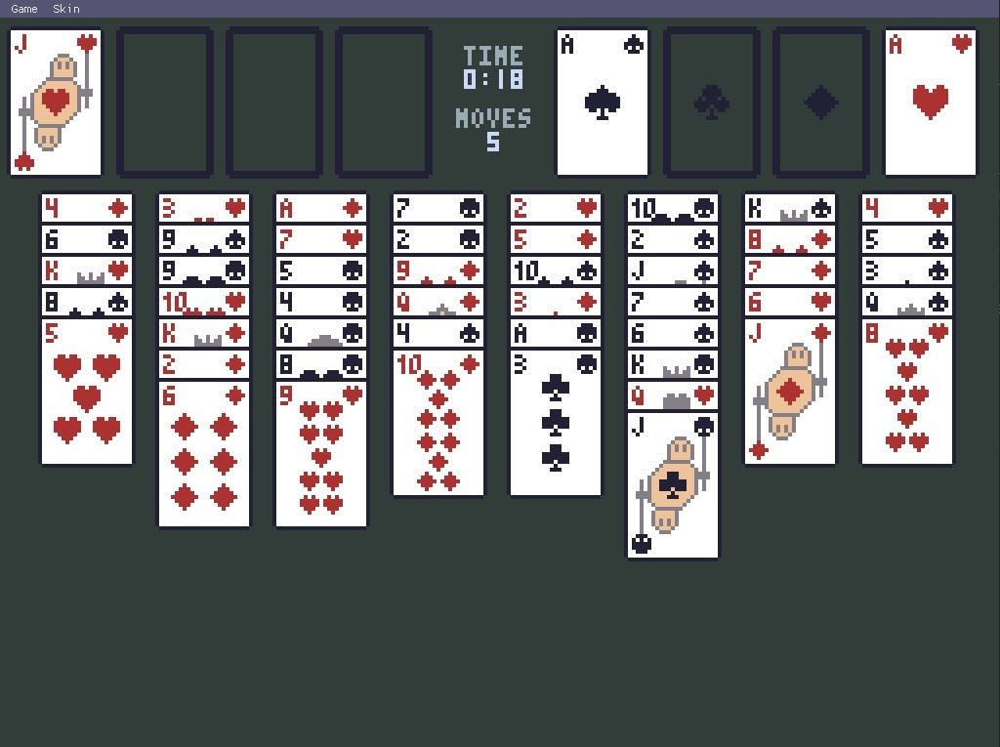
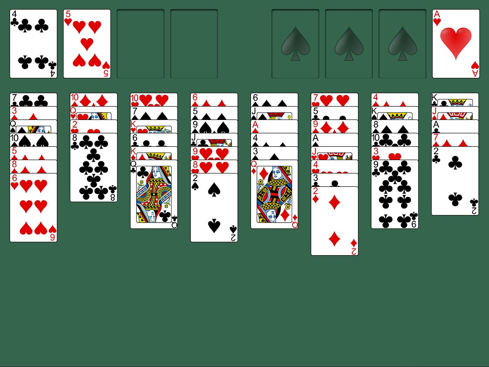

# FreeCell implenentation study
Trying various implementation for a FreeCell game. The different implementations are stored in separate branches.

Each branch can have different submodules, make sure to update them recursively when switching branch.

|Branch|Description|Language|Frameworks|
|-|-|-|-|
|oop|Object Oriented Programming|C++|[onut](https://github.com/Daivuk/onut)|
|c|Plain C|C|[SDL](https://github.com/SDL-mirror/SDL.git)|
|dod|Data Oriented Design|C|[SDL](https://github.com/SDL-mirror/SDL.git)|
|ecs|Entity Component Systems|C++|[SDL](https://github.com/SDL-mirror/SDL.git)|